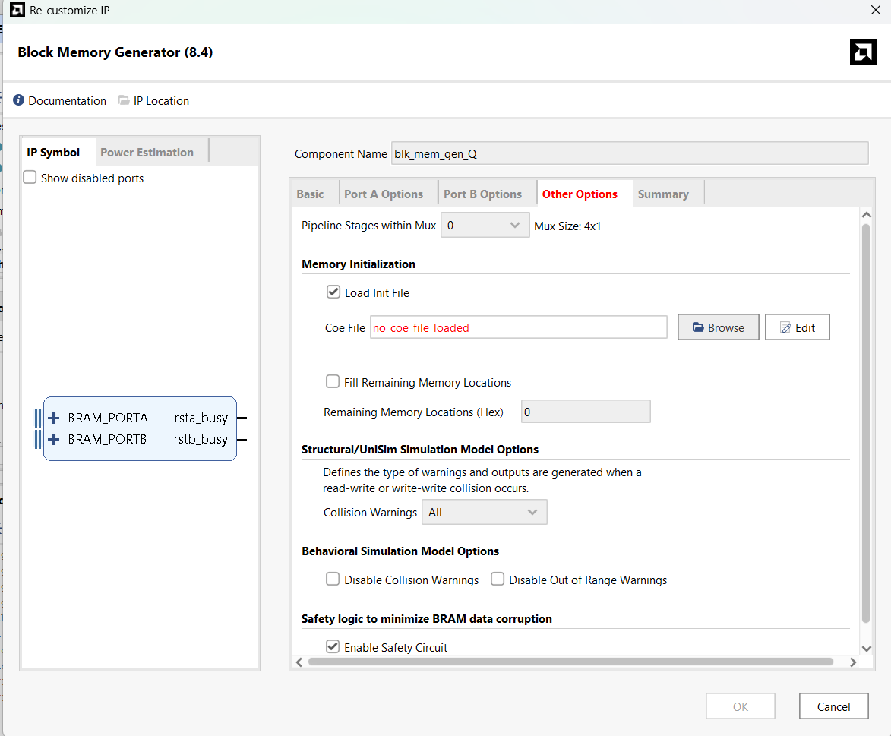
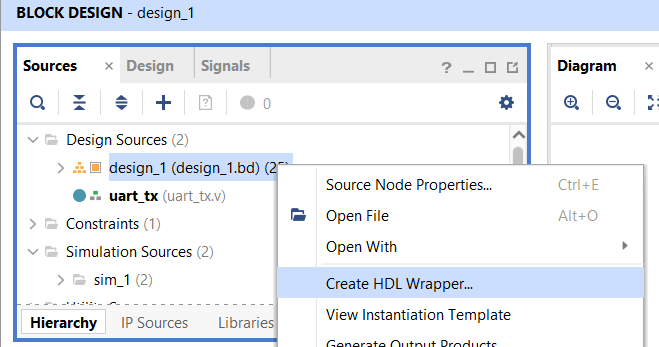
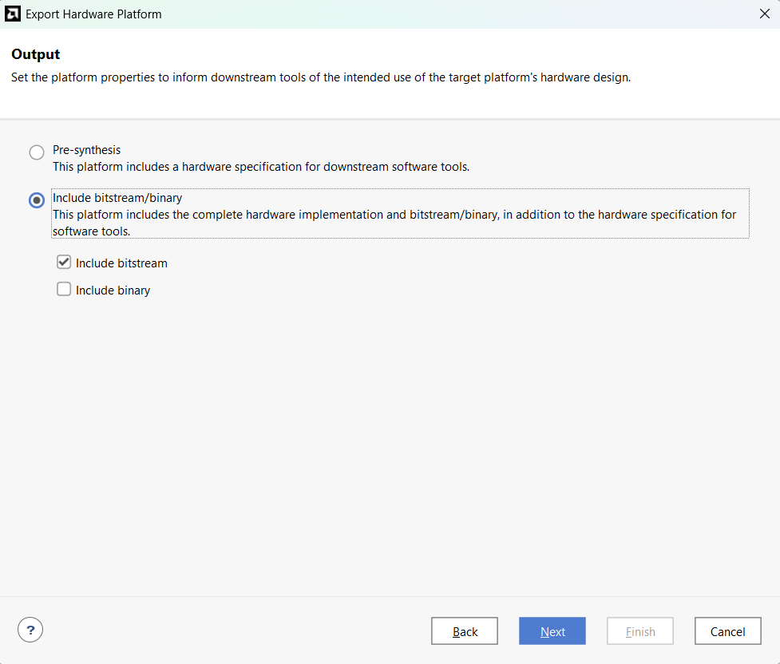

## Vivado Projects

This directory contains three separate Vivado projects, with one project for each precision level. It also includes a `modules` folder containing standalone Verilog modules shared across the designs. There is only a single `uart_txd` module.

These Vivado projects are used to generate the `.xsa` hardware files that serve as the base platforms for Vitis.

## How to Build a Vivado Project

To open and build any of the Vivado projects, follow these steps:

### 1. Open the Target Project
Launch Vivado and open the desired project.

> **Note:** Keep the project path relatively short. Vivado may encounter build or compilation issues when working with deeply nested directories.

### 2. Build and Package the HLS IP Cores
The hardware design is already prepared, but you must first generate your own HLS modules and package them as IP cores.

1. Navigate to the `/hls` directory.
2. Read the `README.md` file located there.
3. Build and package **every IP core** in that directory before continuing.

### 3. Remove the Existing User Repository
Open the **IP Catalog** in Vivado.

You should see a red user repository entry. Remove it before loading your own IP cores.

### 4. Load Your Packaged IP Cores
Open the **Tcl Console** in Vivado and run the following commands:

```tcl
set proj_dir [get_property DIRECTORY [current_project]]
set_property ip_repo_paths [file normalize "$proj_dir/../../hls"] [current_project]
update_ip_catalog
```

This updated the project to use the IP cores you generated in the `/hls` folder.

### 5. Update IPs if Prompted
Once the new IPs are loaded, Vivado may ask whether you want to upgrade or update IP blocks already used in the design. Choose **Yes** and allow Vivado to update them.

### 6. Load Memory Initialization Files
The Block Memory Generator modules do not have initialization files loaded by default. You need to manually configure each of the `three memory blocks`:

1. Open each Block Memory Generator IP.
2. Assign the corresponding `.coe` file.
3. All required `.coe` files are located in the project's `/inputs` directory.



### 7. Create the HDL Wrapper
After all IPs are configured, create an HDL wrapper for the block design. This can be done from the Vivado block design interface.



### 8. Run the Build Flow
Once the wrapper is created, Vivado should automatically set is at the top-level module. Now run the following steps in order:

1. Run Synthesis
2. Run Implementation
3. Generate Bitstream

### 9. Export the Hardware Platform
After bitstream generation is complete:

1. Go to **File** -> **Export** -> **Export Hardware**
2. Select the appropriate export option.
3. Save the generated `.xsa` file.


